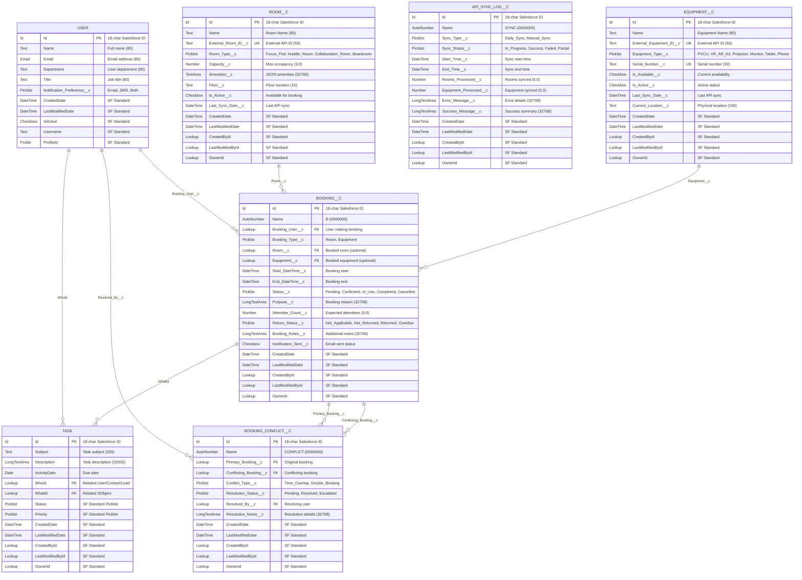

# Dropillo Space & Asset Hub - Salesforce Data Model

## Mermaid ER Diagram (Salesforce Style)



## Salesforce Relationship Details

### Primary Lookup Relationships

1. **USER → BOOKING__C** (1:M Lookup)
   - **Field**: `Booking_User__c` (Lookup to User)
   - **Type**: Required Lookup
   - **Description**: Each user can create multiple bookings
   - **On Delete**: Restrict (prevent user deletion if bookings exist)

2. **ROOM__C → BOOKING__C** (1:M Lookup)
   - **Field**: `Room__c` (Lookup to Room__c)
   - **Type**: Optional Lookup
   - **Description**: Each room can have multiple bookings
   - **On Delete**: Set Null

3. **EQUIPMENT__C → BOOKING__C** (1:M Lookup)
   - **Field**: `Equipment__c` (Lookup to Equipment__c)
   - **Type**: Optional Lookup
   - **Description**: Each equipment can have multiple bookings
   - **On Delete**: Set Null

4. **BOOKING__C → TASK** (1:M Standard Relationship)
   - **Field**: `WhatId` (Standard Task field)
   - **Type**: Polymorphic Lookup
   - **Description**: Each booking can generate multiple reminder tasks
   - **Trigger Generated**: Auto-created via Apex trigger

### Conflict Management Relationships

5. **BOOKING__C → BOOKING_CONFLICT__C** (1:M Lookup)
   - **Fields**: 
     - `Primary_Booking__c` (Lookup to Booking__c)
     - `Conflicting_Booking__c` (Lookup to Booking__c)
   - **Type**: Required Lookup
   - **Description**: A booking can be involved in multiple conflicts
   - **On Delete**: Cascade

6. **USER → BOOKING_CONFLICT__C** (1:M Lookup)
   - **Field**: `Resolved_By__c` (Lookup to User)
   - **Type**: Optional Lookup
   - **Description**: Admin users resolve conflicts
   - **On Delete**: Set Null

### Salesforce Field Constraints & Validation Rules

- **Booking Either/Or Validation**: 
  ```
  AND(ISBLANK(Room__c), ISBLANK(Equipment__c))
  ```
- **External ID Uniqueness**: 
  - `External_Room_ID__c` (Unique, External ID, Case Insensitive)
  - `External_Equipment_ID__c` (Unique, External ID, Case Insensitive)
- **Serial Number Constraint**: 
  - `Serial_Number__c` (Unique, Required when Is_Active__c = true)
- **DateTime Validation**: 
  ```
  Start_DateTime__c >= End_DateTime__c
  ```
- **Future Booking Rule**: 
  ```
  AND(ISNEW(), Start_DateTime__c <= NOW())
  ```
- **Business Hours Validation**:
  ```
  OR(
    HOUR(Start_DateTime__c) < 8,
    HOUR(End_DateTime__c) > 20
  )
  ```

### Salesforce Indexes & Performance

- **Custom Indexes**:
  - `Room__c`: (`Is_Active__c`, `Room_Type__c`)
  - `Equipment__c`: (`Is_Available__c`, `Equipment_Type__c`)
  - `Booking__c`: (`Start_DateTime__c`, `End_DateTime__c`, `Status__c`)

- **External ID Indexes** (Auto-created):
  - `External_Room_ID__c`
  - `External_Equipment_ID__c`
  - `Serial_Number__c`

### Organization-Wide Defaults (OWD)

| Object | OWD Setting | Reason |
|--------|-------------|---------|
| `Room__c` | Public Read Only | All users need to see available rooms |
| `Equipment__c` | Public Read Only | All users need to see available equipment |
| `Booking__c` | Private | Users should only see their own bookings |
| `API_Sync_Log__c` | Private | Admin/System only |
| `Booking_Conflict__c` | Private | Admin only for conflict resolution |

### Sharing Rules & Permission Sets

**Sharing Rules**:
- `Booking__c` shared with "All Employees" (Read Only) for calendar view
- `Booking__c` shared with "Office Administrators" role (Read/Write)

**Permission Sets**:
1. **Space_Asset_User_PS**: 
   - Create/Read/Edit own Booking__c records
   - Read Room__c and Equipment__c
2. **Space_Asset_Admin_PS**: 
   - Full CRUD on all custom objects
   - Manage conflicts and sync logs
3. **Space_Asset_Manager_PS**: 
   - Read-only access for reporting and dashboards

### Field-Level Security (FLS)

**Restricted Fields**:
- `API_Sync_Log__c.*` → Admin only
- `Booking_Conflict__c.*` → Admin only
- `External_Room_ID__c` → System/Admin only
- `External_Equipment_ID__c` → System/Admin only
- `Last_Sync_Date__c` → System/Admin only 