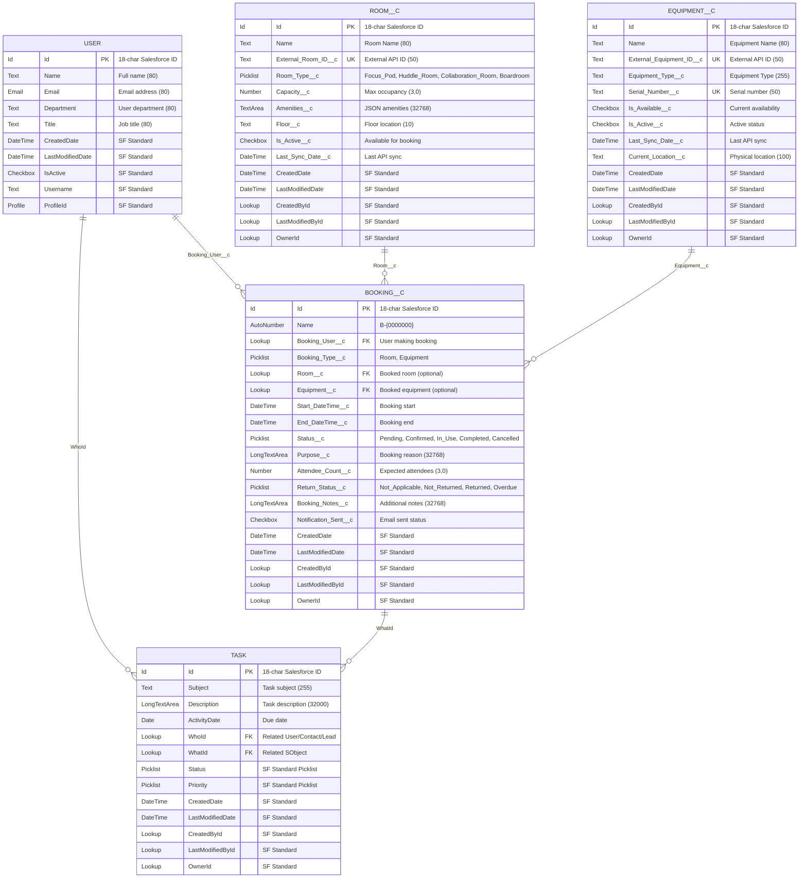

# Dropillo Space & Asset Hub - Salesforce Data Model (Current Implementation)

## Mermaid ER Diagram (Salesforce Style) - IMPLEMENTED OBJECTS ONLY

## Salesforce Relationship Details (CURRENT IMPLEMENTATION)

### Implemented Lookup Relationships

1. **USER → BOOKING__C** (1:M Lookup)
   - **Field**: `Booking_User__c` (Lookup to User)
   - **Type**: Required Lookup
   - **Description**: Each user can create multiple bookings
   - **On Delete**: Restrict (prevent user deletion if bookings exist)

2. **ROOM__C → BOOKING__C** (1:M Lookup)
   - **Field**: `Room__c` (Lookup to Room__c)
   - **Type**: Optional Lookup
   - **Description**: Each room can have multiple bookings
   - **On Delete**: Set Null

3. **EQUIPMENT__C → BOOKING__C** (1:M Lookup)
   - **Field**: `Equipment__c` (Lookup to Equipment__c)
   - **Type**: Optional Lookup
   - **Description**: Each equipment can have multiple bookings
   - **On Delete**: Set Null

4. **BOOKING__C → TASK** (1:M Standard Relationship)
   - **Field**: `WhatId` (Standard Task field)
   - **Type**: Polymorphic Lookup
   - **Description**: Each booking can generate multiple reminder tasks
   - **Trigger Generated**: Auto-created via Apex trigger

